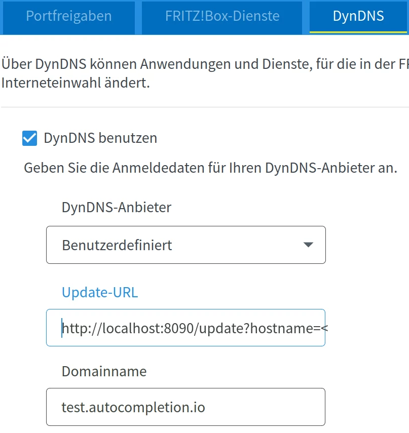

### Updating the IP with a local dyndns server

There are several blog post where people describe how they adapt the resolution of their domain name to a changing ip address.
Instead of polling a "what is my ip" service every minute with a cronjob the fritzbox offers a more elegant solution: A dyndns support that can call a webserver.

You can install this webserver by either

## Run like a Haskell developer

# Install AWS CLI

Assuming Ubuntu

* `sudo apt install awscli`
* look up your key in the aws console
* `aws configure`

# Stack

* `git clone https://github.com/tkvogt/fritzbox-route53`
* `cd fritzbox-route53`
* Installing Haskell stack
* `stack build` in the folder with stack.yaml
* `./.stack-work/install/x86_64-linux-tinfo6/dac5e107f9affd1b3b8c1797ae748b09b977ec0bb02929e29cbc7affc5ad4f04/8.6.3/bin/fritzbox-route53`

*or*

## Run with Docker

TODO: aws configure inside docker. How?

* `git clone https://github.com/tkvogt/fritzbox-route53`
* `cd fritzbox-route53`
* `sudo docker build . -t  updateip`
* `sudo docker run updateip`

## Fritzbox

Then go to Internet -> Freigaben -> Dyndns

and enter your domain name the zone of your dns and this into the Update-URL:

`http://localhost:8090/update?hostname=<domain>&zoneid=Z32NAI0V3I6P4A&ipv4=<ipaddr>`

## Test

* ping your domain
* Unplug the cable of the fritzbox, wait until the light switches off
* Plug it in again to get a new ip address
* ping your domain, and see the new ip
